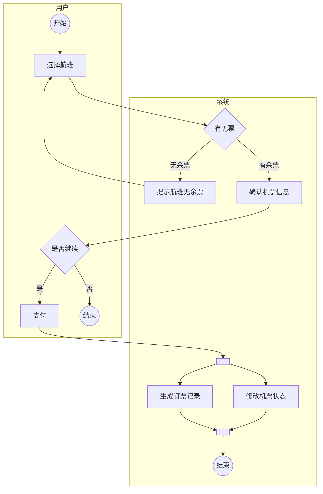
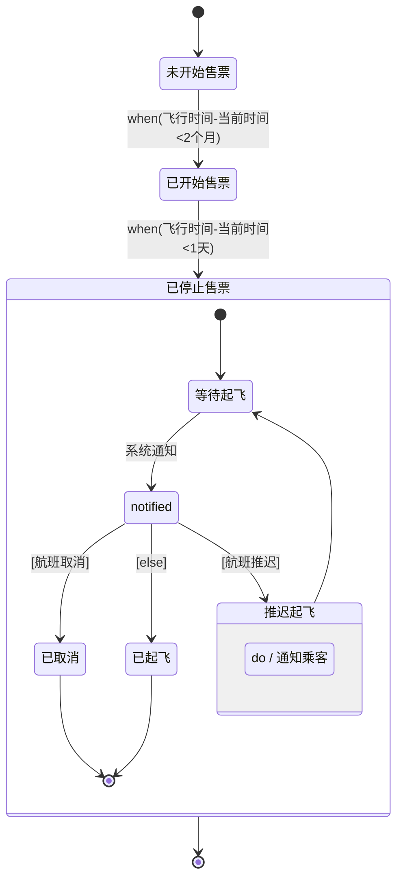

UML (Universe Modelling Language) is a language used to model software systems.
It is a graphical language that allows developers to visualize the structure and
behavior of a software system.

In this article, we will discuss the different types of UML diagrams and their
uses.

## Types of UML diagrams

UML diagrams are used to represent different aspects of a software system, such
as its structure, behavior, and interactions.

UML diagrams can be categorized into four main types based on their use phase:
- 需求分析阶段
    - 用例图 (Use Case Diagram)
    - 数据流图 (Data Flow Diagram)
    - 活动图 (Activity Diagram)
- 系统设计阶段
    - 类图 (Class Diagram)
    - 序列图 (Sequence Diagram)
    - 状态图 (State Diagram)
    - 组件图 (Component Diagram)
    - 包图 (Package Diagram)
    - 时序图 (Sequence Diagram)
    - 实体-关系图 (Entity-Relationship Diagram)
- 实现与测试阶段
    - 流程图 (Flowchart)
- 部署阶段
    - 部署图 (Deployment Diagram)

## 需求分析阶段

### Activity Diagram

Currently (2026-03-30), activity diagram hasn't been supported by Mermaid. So
just use flowchart to replace it.



## 系统设计阶段

### State Diagram

Mermaid:


### Component Diagram

Not officially supported by Mermaid:
```mermaid
```

## 部署阶段

### Deployment Diagram

Not officially supported by Mermaid:
```mermaid
```
